# Automated Packing and Storage System


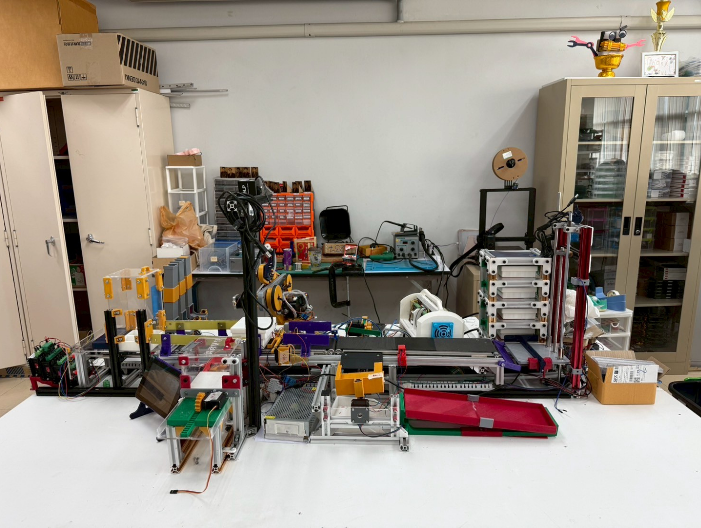

## Overview
This project is an automated multi-stage conveyor system designed for industrial sorting and inspection simulation. Developed as a comprehensive robotics and automation project at Kasetsart University Sriracha Campus, it integrates an Arduino-based embedded control system for sequential material handling with a vision-based inspection pipeline. The system aims to improve throughput and operational efficiency through process optimization.

## System Architecture
The production line operates autonomously across 6 distinct stations:

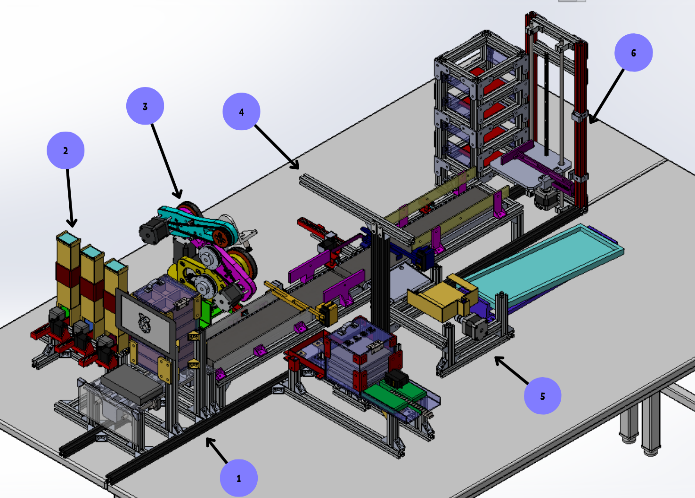

* Station 1 (Box Feeder): Stores unused boxes and systematically dispenses them onto the main conveyor belt.
* Station 2 (Control & Dispenser): Houses the HMI UI acting as the main controller for user input. Operators can configure shape target profiles (Circle, Square, Hexagon) before items are dispensed.
* Station 3 (Pick and Place): Utilizes a custom robotic arm to pick up items selected by the user, places them precisely into the boxes, and closes the boxes with a lid.
* Station 4 (Vision & Sorting): Features a camera housing unit running an OpenCV pipeline for shape detection (e.g., white box tracking) to inspect the items inside the box.
* Station 5 (Faulty Unit Storage): Actively separates items and boxes that fail the vision inspection, storing them aside for later use.
* Station 6 (Good Unit Storage): Stores finalized boxes that successfully pass the inspection while continuously checking for available storage space.

## Station 1: Box Feeder (Material Infeed)

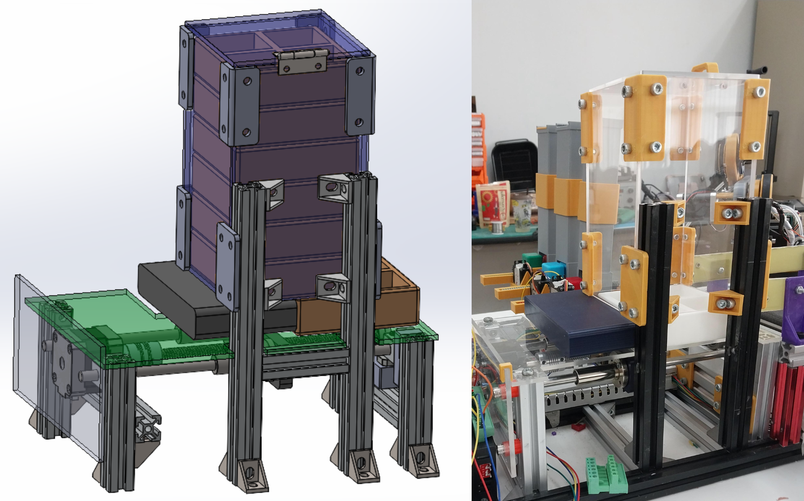

This station serves as the starting point of the packaging line.
* Functionality: It acts as a magazine that stored unused boxes.
* Mechanism: Upon receiving a system start signal, it utilizes a motorized dropping mechanism to systematically dispense the box onto the conveyor belt, ensuring consistent spacing and timing for downstream operations.

## Station 2: Control & Item Dispenser (HMI & Order Processing)

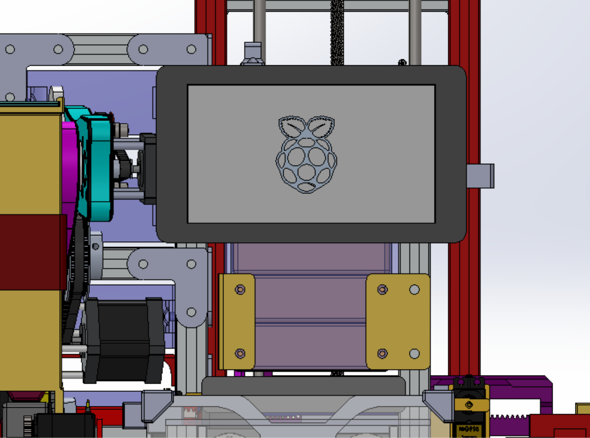
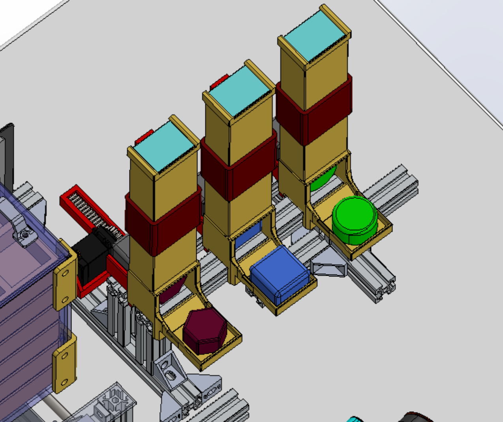
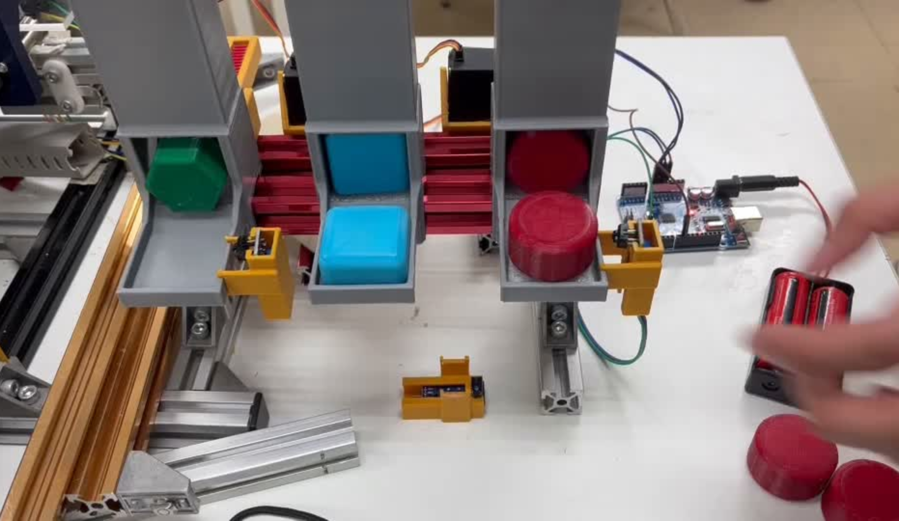

This station acts as the brain of the user interaction and the inventory buffer.
* Human-Machine Interface (HMI): It housed the display and act as a controller for user input. Operators use the custom UI dashboard (Operator Settings) to create specific packaging orders, selecting target shapes such as Circle, Square, or Hexagon.

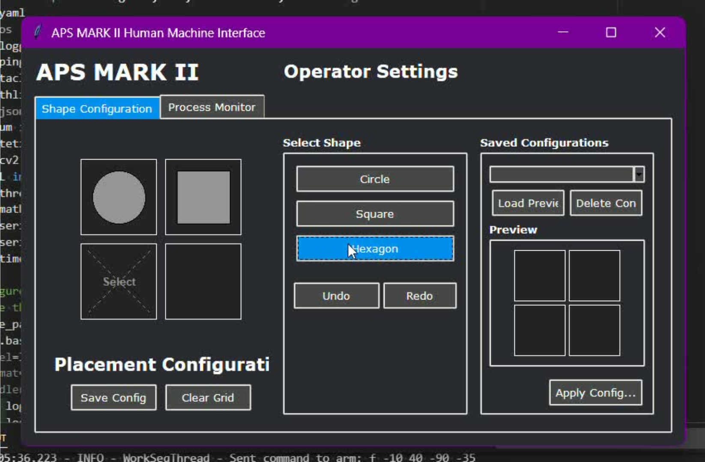

* Dispensing System: It stored the items and physically dispense the items to Station 3 based on the specific sequence programmed by the operator.

## Station 3: Pick & Place (Robotic Manipulation)

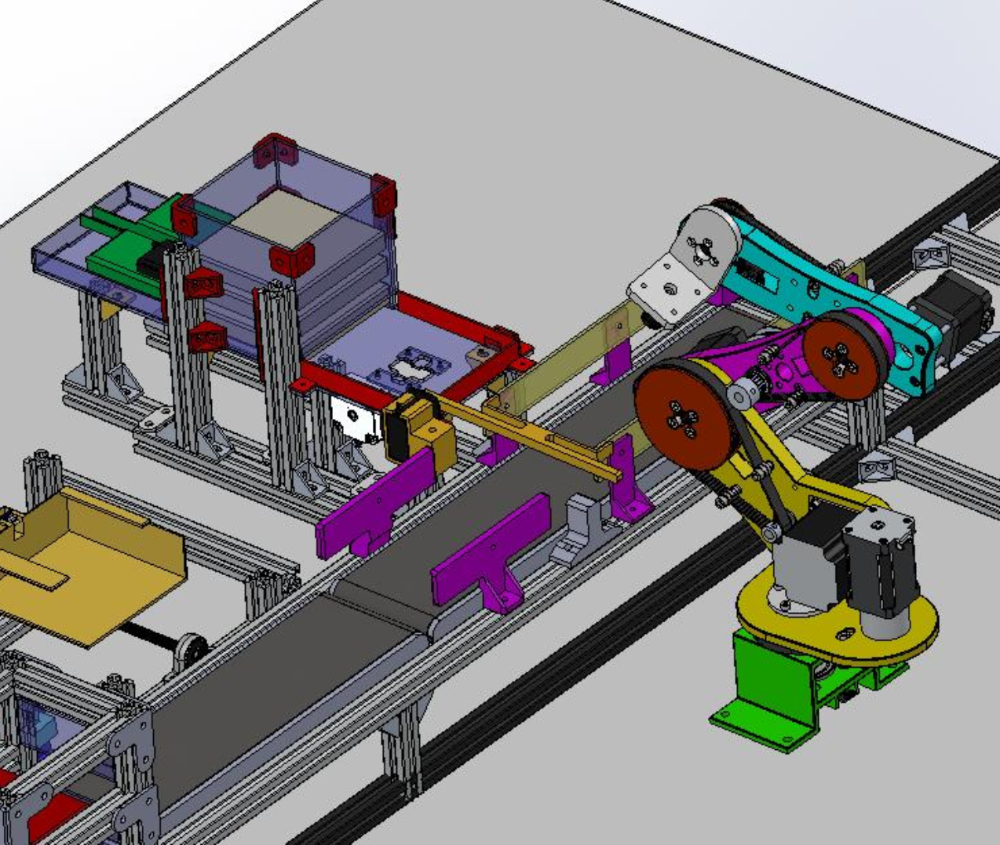

This is the core mechanical handling unit of the system, featuring a custom-built, belt-driven robotic arm.
* Item Handling: The arm is programmed to pick up the items selected by the user from Station 2 and accurately place the items in the box as it travels down the conveyor. The arm utilizes pre-defined coordinates for each specific shape to optimize cycle time.
* Packaging: Once the item is successfully placed, the station uses a dedicated lid dispenser mechanism to close the box with lid, preparing it for the final inspection phase.

## Station 4: Vision Inspection (Quality Control)

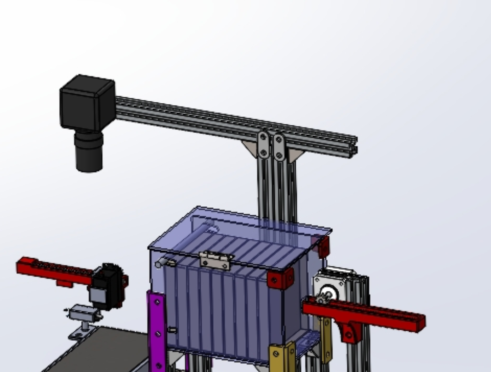

This station ensures product quality using Computer Vision algorithms (OpenCV).
* Perception Pipeline: It housed the camera which is used to check to item in the box. The system runs a script for "White Box Shape Detection" to verify that the item placed inside matches the original order generated at Station 2.
* Lid Management: This station is also integrated with the system that stored and dispense the lid, working in tandem with the visual pass/fail logic.

Example code

(```python)
# Example Snippet: Shape Classification Pipeline (Station 4)
def detect_shape(frame, target_shape):
    gray = cv2.cvtColor(frame, cv2.COLOR_BGR2GRAY)
    blurred = cv2.GaussianBlur(gray, (5, 5), 0)
    _, thresh = cv2.threshold(blurred, 60, 255, cv2.THRESH_BINARY)
    
    contours, _ = cv2.findContours(thresh, cv2.RETR_EXTERNAL, cv2.CHAIN_APPROX_SIMPLE)
    
    for contour in contours:
        epsilon = 0.04 * cv2.arcLength(contour, True)
        approx = cv2.approxPolyDP(contour, epsilon, True)
        vertices = len(approx)
        
        # Classification Logic
        if vertices == 4:
            shape = "Square"
        elif vertices == 6:
            shape = "Hexagon"
        elif vertices > 8:
            shape = "Circle"
            
        return check_quality(shape, target_shape)
(```)

## Station 5: Faulty Unit Separation (Reject Station)

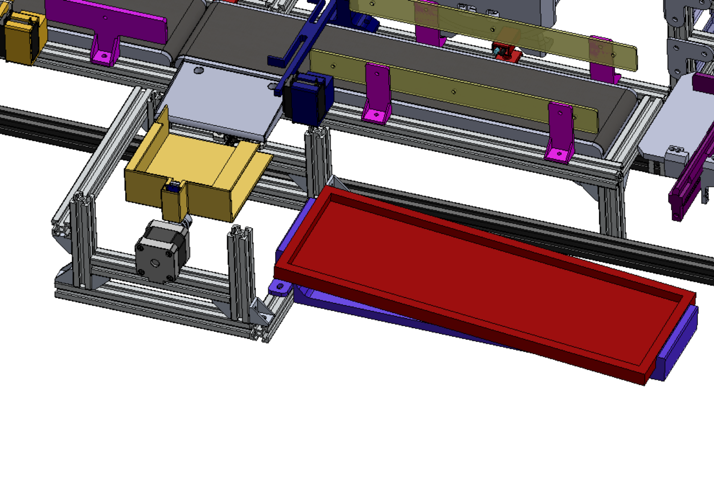

This station manages the automated sorting of units that fail the vision inspection.
* Error Handling: If Station 4 detects a mismatch or anomaly, Station 5 triggers a mechanical pusher to separate item from a faulty box by moving it off the main conveyor.
* Recovery: Rejected units are placed into a designated red recovery tray where it stored the box and items for later use or manual reassessment, preventing production line bottlenecks.

## Station 6: Automated Storage (Final Inventory)

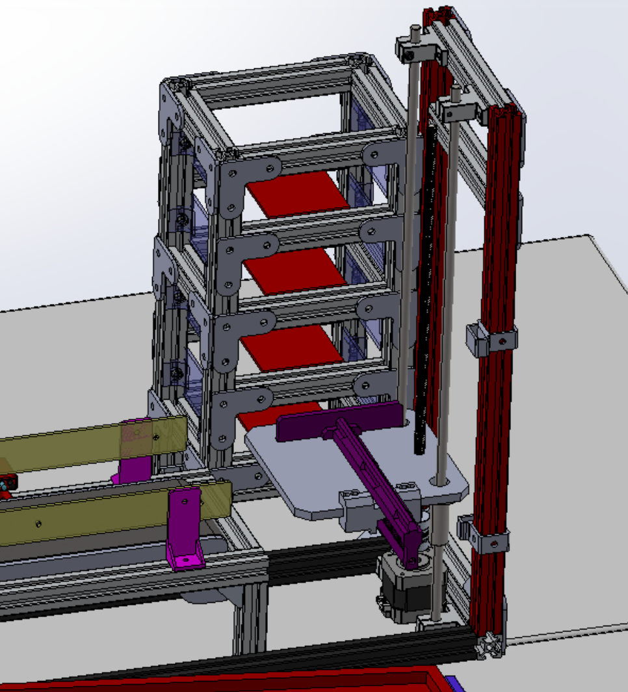

The final stage is an automated vertical storage rack for completed, verified products.
* Storage Logic: It stored box that pass the inspection.
* Smart Indexing: The system uses a motorized Z-axis elevator. Before placing a box, the microcontroller utilizes sensor logic to check for avaliable space in the multi-level rack. The embedded C code relies on a complex sensor-driven state machine (e.g., evaluating limit switches with logic like else if (st1 && !st2 && st3)) to determine the exact vertical position to safely store the finalized package.

## Current Status
* At the moment the project is at 90% 
* All station can successfully work as intended
* Station 1-6 can now work all together (Station 5 need some minor Adjustment)
* Some components are broken and need to been replace which result in delay

## Team Members
* Jerich Brylle Sison
* Natapong Wongphodee
* Natchaphon Sommai
* Theerapol Guanmuangtai
* Norrawich Lortrakanont
* Phongphisut Thongnopakun
* Rachen Wanbunma
* Setthanee Nithedsilp